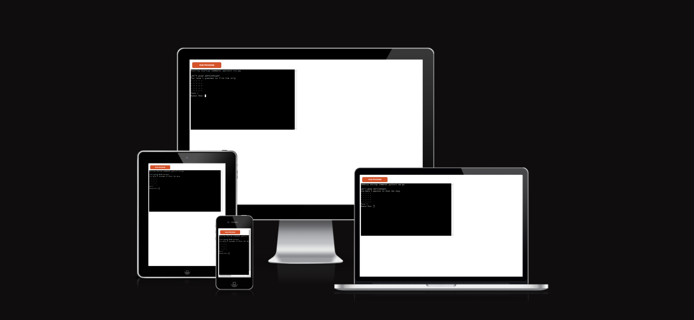
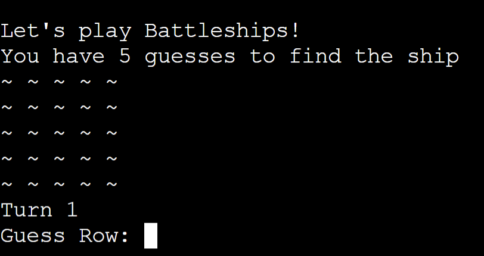
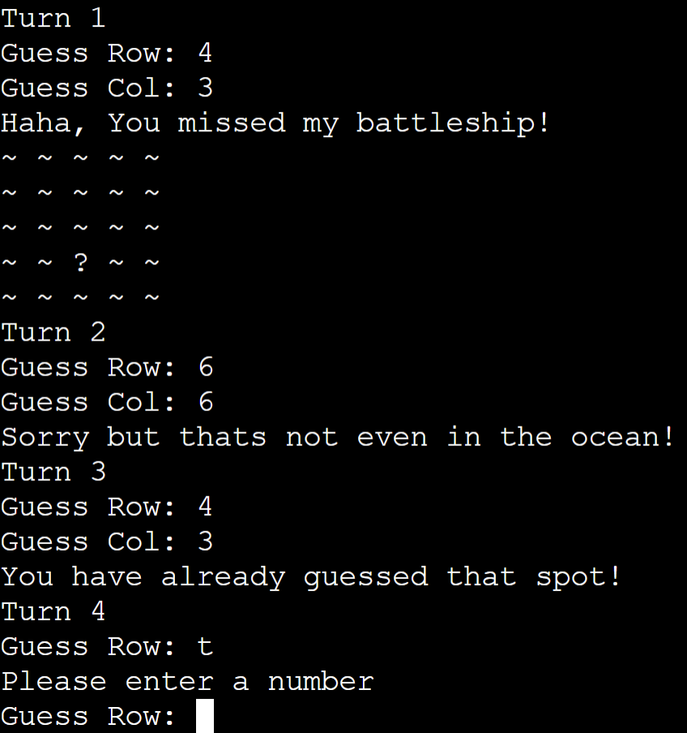
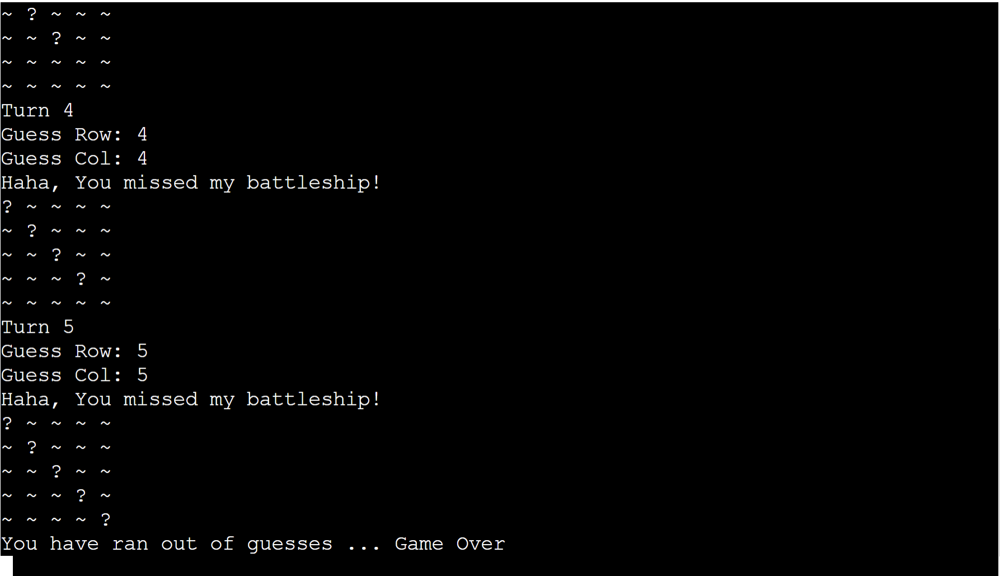
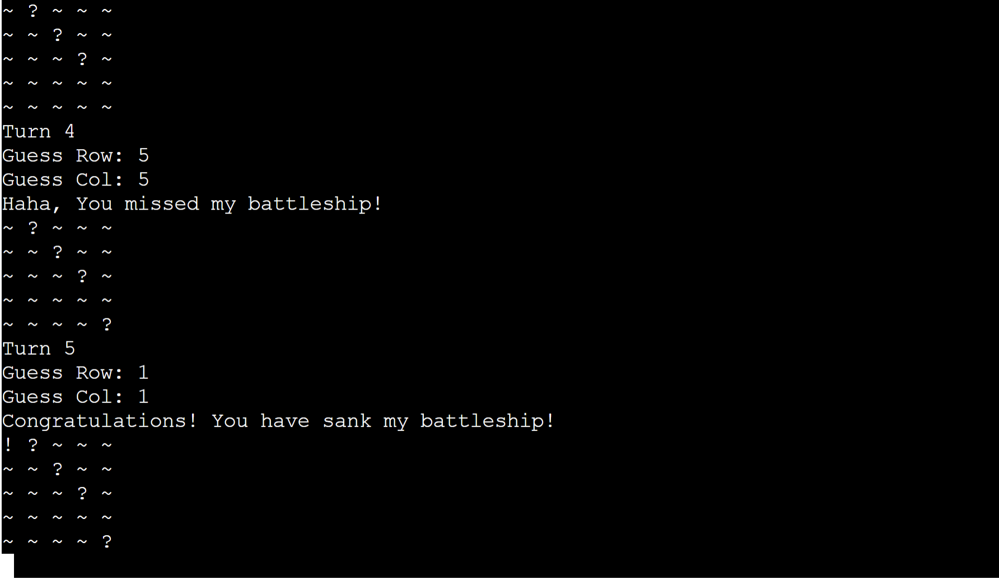

# Welcome to my battleships game!
## [Live Website](https://battle-of-ships.herokuapp.com/)
--- 

This battleships game is playable in the terminal and involves a player vs the computer battle! The player will try and guess the location of the computer’s battleship. The player will only have a set number of choices to find and destroy the battleship. If they player runs out of turns then it is game over… if they player finds the ship before running out of turns the they will win!

# How to play:
* The first thing you will see is an introductory message “Let’s play battleships!”. it will also display “you have 5 guesses to find the ship”. Then you will see the battle ships board a five-by-five grid with “~” displaying as the ocean. Just underneath will be your turn count.

* You will then see an option to guess a row, shortly after you will be asked to guess a column. Once you have guessed you will see one of three messages: “that’s not even on the board!”, “congratulations you have sank my ship”, “ha-ha, you missed my battleship”. 

* You will then see the five-by-five grid once again but this time a symbol showing ether a hit “!” or a miss “?”. If the coordinates you put in wasn’t even on the board, you will see the board displaying only the ocean. If you missed, then you turn count will increase. 
This will be repeated untill you have ether destroyed the ship or have run out of turns! 
---
## User stories:
* As a visiting user, I would like to play the game of battleship
* As a visiting user, I would like to be able to select the row and column
* As a visiting user, I would like to see validation on errors
* As a visiting user, I would like to see my turns increase the more I play

---

## Exsisting features:
* Random board generation
  * user cant see computers ship 

* Accepts user input so user can decide what row or column.
* Tracks the number of turns the user has taken.

* Error validation and input validation
  * User has to enter a number
  * User cant enter a number bigger then the grid
  * User cant enter the same guess twice

* Messsages to display a win or a loss.

 * Loss:

* Win:

---

## Future features:
* user can play another user
* user can change board size
* user can select from a range of ships 
* user can change orientation of ships 
* user will be able to track wins between the computer and friends

---

## Technology:
* The technology I used was:
  * Python

---

## Testing:

### Code validation:
* Tested using pylint 
* Follows all PEP8 guidelines 

### Testcases:
* step 1: user will press run program on live site
* Step 2: The user will see a welcome message "lets play battleships"
* Step 3: The user will be shown the ammount of turns they have.
* step 4: The user will see a 5 by 5 grid containing "~" to symbolise the "water".
* Step 5: The user will see the current turn they are on.
* Step 6: The user will see a message asking the user to enter a row.
* Step 7: The user will see a message asking the user to enter a column.
* Step 8: The user will see the board displayed with they guess or error messages(see exsiting features).
* step 9: The user will repeat steps 5 and 6.
* step 10: The user will be shown a messsage if they have won or ran out of turns (see above).

### Fixed bugs:
 * User validation on same guess was not working
 * User could enter a invalid coordinate not a number
 * User could enter a negative number

---

## Deployment:

### Gitpod:
* This site was also viewed through a browser using Gitpod, This is how I achieved this :
 * Open your repository through Github.
 * At the top of yout repository click on the gitpod button.
 * When it had loaded adn you can view your code, within the terminal type "python3 -m http.server"
 * Wait for the pop up in the bottom right hand corner of Gitpod.
 * Select the open browser option and it will redirect you to your webpage.

### Heroku: 
* Login to Heroku
* Navigate to dashboard and select "New" -> "Create new app"
* Create app name and select region
* navigate to settings
* Add two build packs "Python" then "Node Js" (Python has to be first)
* Click on the deploy nav link
* select github 
* Enter the name of your repository and select the correct one
* scroll down to bottom of the deploy page and select manual deploy 

---

## Credits:
Code institute 